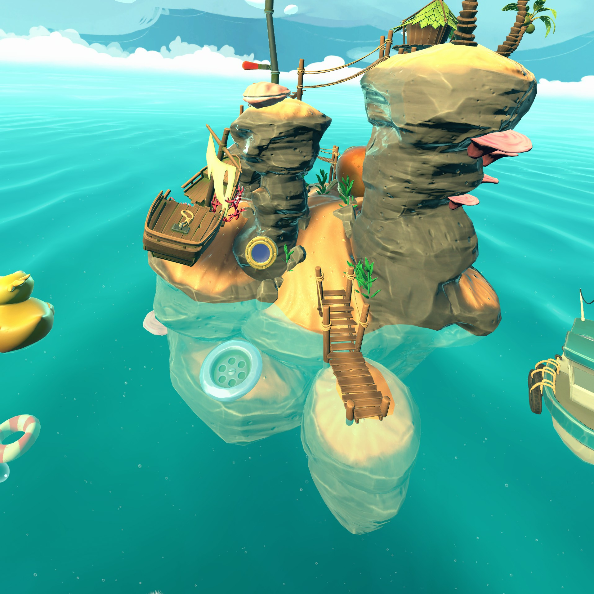
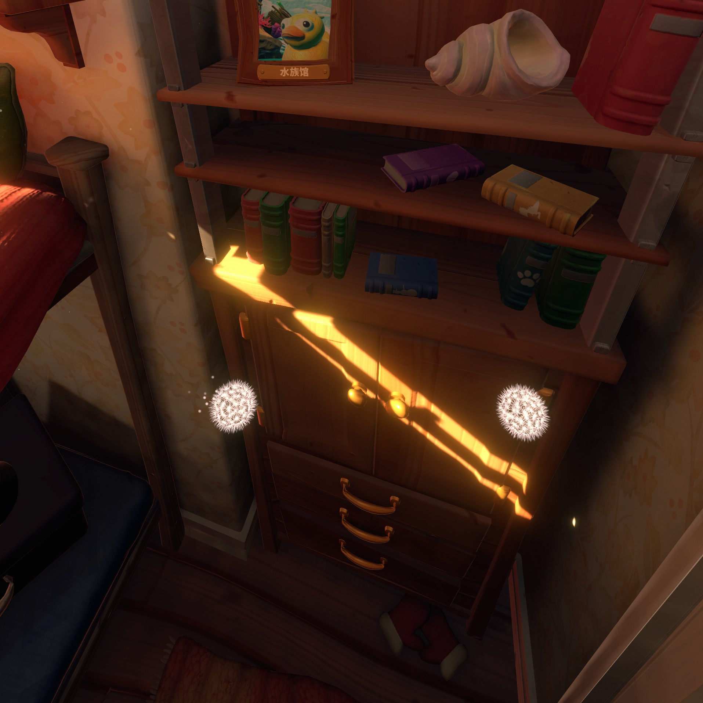
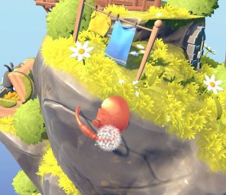
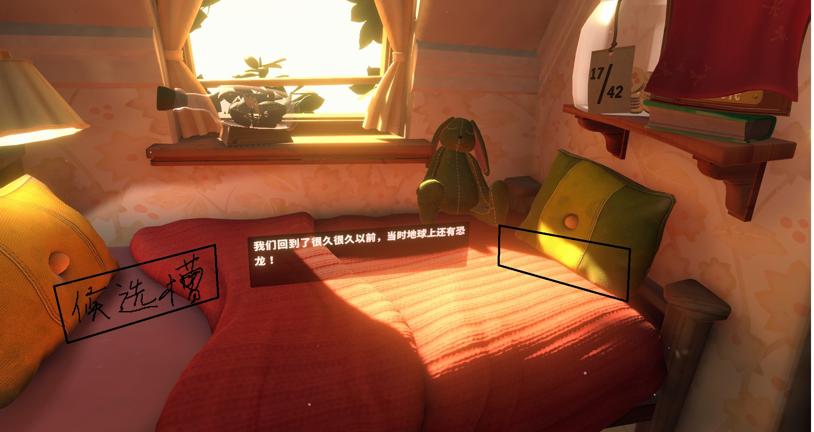

# The Curious Tale of the Stolen Pets
## 游戏概况
- 发行日期：2019/11/14 
- 简介: 体验一个孩子般奇妙的互动故事！ 通过探索从头开始为VR制作的精彩微缩世界，帮助你的祖父解决被盗宠物之谜。在寒冬的景致中使用吹风机融化冰雪！搜索部分隐藏在水面之下的海盗船残骸！每个世界都独一无二，充满了互动和丰富多彩的生活。
- 标签：解密，卡通，童话，治愈，箱庭
- 通关时间 1小时
- 开发商：
Fast Travel Games
- 发行商：
Fast Travel Games
- 引擎：Unity2018.4

## VR交互拆解
### 玩家移动方式
这个游戏比较特殊，玩家想在场景里移动的话就必须在现实里移动，没有其他方式。原因也很简答，需要交互的东西就是一个小小的环形世界。 不过玩家可以通过左摇杆来旋转世界，右摇杆来调整高度（到通关都没发现）

### 玩家在世界中的存在
只有两只蒲公英球。 玩家试图抓取的时候会变小,玩家也可以通过抓取空间中的任意一点，旋转世界。

### 物理交互
玩家的手是可以穿模的，把物体拿起后，物体的也可以穿模。

## 本地化
游戏中环境中不会有文字，所有指示都是用图案的形式。字幕的话和其他游戏固定于玩家视野的方式不同。游戏中的字幕有固定的槽位，当玩家的视角看向某处时，会选择角度最接近的。

## 画面
天空盒画的非常好看，游戏中的人物动物的动画都是抽帧的

## 辅助性功能
游戏开始的时候会检测玩家头部的高度，补偿到一个默认高度
 
## 总体推荐程度 2.5/5
优点：  
1. 画面风格优秀，非常温馨

缺点
1. 游戏太短，谜题很多很牵强
   

游戏拆解不易，截图比传统游戏麻烦很多，喜欢的观众可以点个赞，有想让我点评游戏或者游戏游玩中需要我关注的细节可以在发在评论区里
### 目前正在体验或者待体验的游戏有
## 背景信息
- 体验设备 quest3
- 运行设备 pc 
- 串流方式 steam link